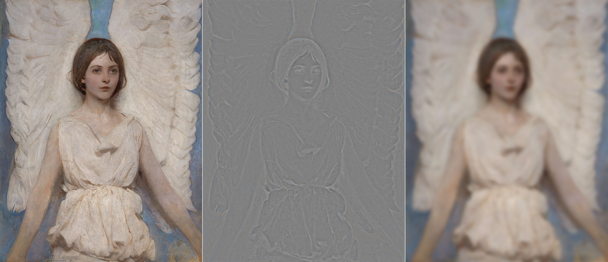
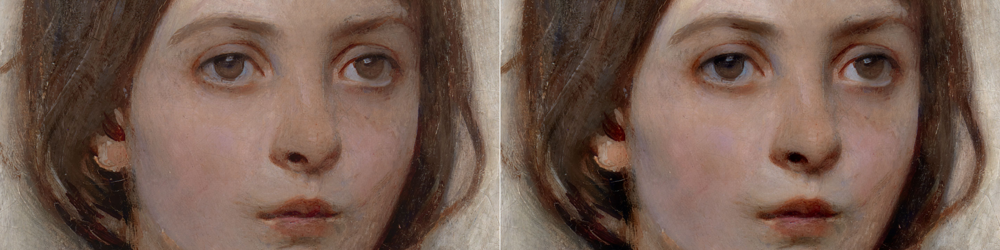

# Frequency Separation 2021

A long (long) time ago I wrote an essay on Frequency Separation, even if the main subject was disguised in the more approachable title "Notes on Sharpening". That was early 2009, way before Frequency Separation was cool, then popularized/mainstream, then possibly cool again.

I've thought to revisit the original article to give the subject a new coat of 2021 paint, plus all sorts of new detours. 

Spoiler alert: I'm interested in Frequency Separation (FS from now on) as a tool for a broader set of manipulations not limited to, nor particularly focused on, beauty/skin retouch. 

If the original 2009 synopsis is your cup of tea then welcome to the rabbit hole.

> Sharpening with Gaussian and edge-aware blurring kernels; a new experimental approach on High-Radius Low-Amount contrast enhancement; how to separately target edges and texture in the same high frequency range. Gaussian, Bilateral and Mixed pyramid decompositions.

## 1. Frequencies

I assume that you already know what we're talking about, but TL;DR any signal, e.g. a sound wave no matter how complex can be built composing _"pure"_ frequencies. 

Low frequencies are at the bottom, high on top, black is the result. If you want to understand the concept better, [this article](https://www.jezzamon.com/fourier/index.html) goes in much more detail and will blow your mind too.
	
In the more familiar realm of images, you can think of high frequencies as describing thin detail (given a defined area, _a lot of stuff happens there_), while low frequencies are in charge of spatially _slower changes_:

## 2. Basic frequency separation

As opposed to the signal wave example, with images we usually deal with _frequency ranges_. When you filter with Gaussian Blur (Filter > Blur > Gaussian Blur, GB from now on) e.g. radius 10px, you're getting rid of all the high frequencies (i.e. detail) that _live_ in the smaller-than-10px range. Whereas if you High-Pass (Filter > Others > High Pass, HP from now on) with the same radius you're doing the opposite: you're left with everything that lives in the smaller-than-10px range (only the high frequencies are allowed to pass – hence the filter name).

I've picked [this image](https://www.si.edu/object/angel%253Asaam_1929.6.112) for most of the examples – it's a 1887 painting by Abbott Handerson Thayer, a portrait of his daughter from the Smithsonian Institute collection.

In the early days we used to combine the GB and HP layers (the latter in Linear Light blending mode, 50% opacity) but that's not really precise enough for our purposes here. There are two ways to deal with a proper frequency decomposition, depending on whether the file is 16bit or 8bit.

- Duplicate the original (O) twice, and call the two new layers L (low) and H (high). 
- Place H above L, hide H and select L.
- Apply GB to L, with a radius large enough so that the detail that you want to migrate to the other layer disappears.
- Select H, then Image > Apply Image with the following settings

- Change the H blending mode to Linear Light (LL from now on)
- Optionally, clip H to the L layer (Alt or Option click the line in between the L and H layers in the Layers palette)

You should end up with this simple setup:

That is to say: the original layer, and the same built with a Low + High frequency decomposition. They are 100% identical, but why? And also, why different Apply Image settings for 8/16bit? That's not been discussed very much (if at all): to properly understand we need to get into blending modes maths.

## 3. Blending Modes maths

Blending modes are arbitrary ways to mix two layers – say a Base (B) below and an Active (A) above – according to a formula. 

Some blends are easier if applied on normalized values, i.e. in the range (0,1). Multiply, for instance, is a well known darkening blending mode, but not if the multiplication is simply calculated with pixel values in the (0,255) range. Let's pretend that we have the following values – I take in consideration one channel only for simplicity's sake:

A = 51, B = 153;  
A * B = 51 * 153 = 7.803 

A brightened result, that must be normalized with a 255 factor to be meaningful (and appear as a darkened value):

(51 * 153) / 255 = 30.6 

If you normalize them first it's the same

A = 51/255 = 0.2; B = 153/255 = 0.6;   
A * B = 0.2 * 0.6 = 0.12  
0.12 * 255 = 30.6

When the result is out of scale it's just clipped to 0 or 255, unless further blends are to be calculated.

Various online sources state that Linear Light is a mix of Linear Dodge (Add) and Linear Burn. Is it really? (Spoiler alert: no) Let's test it. With **Linear Dodge (Add)**, the formula for the blend is **(A + B)**. Being a simple addition, you can use both the normalized (0,1) or the (0,255) range, it makes no difference. Using the same values of A, B:  

A + B = 0.2 + 0.6 = 0.8  
0.8 * 255 = 204  
A + B = 51 + 153 = 204

The **Linear Burn** formula is **A + B - 1**: an addition follwed by an inversion (white is subtracted).

A + B - 1 = 0.2 + 0.6 - 1 = -0.2; (clipped to 0)  
A + B - 1 = 51 + 153 - 255 = -51 (clipped to 0)

Let me stress that "inversion" here means "subtraction with white", which is 1 in a normalized range, 255 in 8bit documents.

The **Linear Light** formula is instead **2A + B - 1**, so twice the impact for the top layer. If you draw a gradient from Black to White on a new document, duplicate the layer and change its blend mode, these are the result for Linear Dodge/Burn/Light:

So I'm afraid no, LinearLight **is not** "a combination of Linear Dodge and Linear Burn" because the slope of the curve is different. It's not a shift of either formulas (resulting in A + B - 0.5), which would have in fact pivoted the line around (0.5, 0.5). With Linear Light the slope is steeper – and in fact the formula is 2A + B -1.

Now that we've got this, let's try to understand why Linear Light works with the kind of Apply Image that we've used. There's nothing inherently "frequency separation-y" with Linear Light, it just happens to combine perfectly with the sort of Image Calculations we've performed. We'll start with the 8bit version, and move to the 16 bit next.

The Apply Image step was the Original minus the Blurred (hence the Subtract mode) with Scale 2 (meaning divided by 2) and Offset (i.e. plus) 128 that is normalized to 0.5. All this is equal to the grayish detail layer, which is then set to Linear Light mode: being on top, let's call it A. The layer below (B) is the Original, and the blend formula for Linear Light is 2A + B - 1. Let's substitute A with (Original - Blur)/2 + 0.5 in the formula and you see that everything simplifies to Original, QED.

In other words, we've demonstrated why this particular Subtraction (with Scale 2, Offset 128) perfectly combines with the Linear Light blending mode (that is not a combination of Linear Dodge/Burn but something else) to return an identical copy of the original. Cool!

Let's see how the theory works with 16 bit files and its different Apply Image.

Here we're Adding to the Original the inverted Blurred (hence 1 minus Blurred, this is how you invert pixels), scaling 2 (i.e. divided by 2). This is again the detail layer then set to Linear Light mode: we call this A, and B is the Original. Applying the same blending formula 2A + B - 1 we can substitute A in it and everything again simplifies to the Original. Great!

So it's not that Linear Light is a magic blend mode, nor that it fits Frequency Separation. The Apply Image settings happen to work with Linear Light in returning the original values.

Then why two different methods with 8bit/16bit documents? You're ready for some bit depth Maths.

## 4. 8bit vs. 16bit Maths

For 8bit images, pixel values are in 2^8 = 256 range, i.e. **(0,255)**. Black is zero, White is two-hundred-fifty-five. You might be tempted to assume that 16bit works the same, but it turns out that Adobe Photoshop's **16bit is in fact 15bit + 1**, meaning 2^15 + 1 = 32768 + 1 = 32769, expressed in the range **(0,32768)**. Why? The accepted answer is that _"this gives a midpoint to the range (very useful for blending), and allows for faster math because we can use bit shifts instead of divides"_ ([source](https://web.archive.org/web/20181204083457if_/https://forums.adobe.com/thread/792212)).

### 4.1 8bit special inversion

I've tried to reverse engineer the way Photoshop handles pixel calculations, and there is something interesting going on here. Let's create a dummy test document, 8bit.

As you see I've created two layers, solid 102,102,102. When the topmost is in Linear Light I would expect the blend to be 2A + B - 1, where 1 is the highest value possible in the (0,255) 8bit range, that is to say White: 255. Hence the formula would give:

LL = 2A + B - 1 = 2*102 + 102 - 255 = **51**

Alas, ["computer says no"](https://youtu.be/0n_Ty_72Qds), and PS calculates **50**. There are no divisions here, so I wouldn't expect rounding errors of any sort, it's quite straightforward. I've tested it with a bunch of different pixel values for the top and bottom layers, and the result is _always off by 1_. 

Out of curiosity I've tested _Affinity Photo_'s behaviour and it works as I'd expect:

The only explanation is that Photoshop **subtracts 256 instead of 255**. This is in fact the case, and the explanation is that otherwise there would be no neutral color in Linear Light with 8bit documents. 

LL = 2A + B - 1

A is the layer above, the one which middle gray is meant to be "neutral" (have no effect) in the blend. Let's rewrite it as:

LL = B + (2A - 1)  
LL = B + deltaA

Where:

deltaA = 2A - 1

There must be a value of A (the neutral, mid-gray) such that deltaA is equal to zero. But using 255 as the white, zero is nowhere to be found. 

A = 128, deltaA = 2*128 - 255 = 1 
 
A = 127, deltaA = 2*127 - 255 = -1

Instead, if you subtract 256 the neutral value happens to be 128, which is in fact the proper mid-gray value in use:

For A = 128, deltaA = 2*128 - 256 = 0

**This is true for 8bit documents only**. 

Given the particular nature of 15bit + 1 of nominally 16bit documents, there are 32769 values in the (0, 32768) range, there's no need to _fake_ the white subtraction. The White used is in fact the proper 32768.

LL = 2A + B - 1 = 2*13107 + 13107 - **32768** = 6553

### 4.2 Image Calculations: 8bit 

I've created an edge and noted the pixel values for the Original layer that you can see either in the Info palette for the two color samplers and in the layer name as well. I've also added a Blurred (2px radius) layer – trust me the color sampler values are ones in the Layers palette.

Let's crank some numbers and see if we're able to calculate the Apply Image value. 

Please note this is an 8bit file, so let's start with the recommended calculation, a **Subtraction with Scale 2 and Offset 128**.

Orig = 153; Blur = 112;  
Apply Image = (Orig - Blur)/2 + 128 =  
= (153 - 112)/ 2 + 128 =  
= 41/2 + 128

Let me pause for a moment: 41/2 here is equal to 20, for there's no such a thing as 20.5 in the integers (0,255) range – more on rounding in a minute.

Apply Image = 20 + 128 = 148.

Which is exactly the correct value that Photoshop comes up with:

A quick check for the darker values too: 

Orig = 51; Blur = 92;  
Apply Image = (51 - 92)/2 + 128 =  
= -41 / 2 + 128 =  
= -20 + 128 = **108**

Which is exactly what you can see in the Info palette above. We've confirmed the Apply Image result. 

Now it's kinda easy, we need to apply the Linear Light formula (2A + B - 1), where A is the value we've calculated, B is the Blurred, and 1 is the "special" white that Adobe uses for 8bit Linear Light, i.e. 256.

Lighter values on the left:  
LL = 2*148 + 112 - 256 = **152**

Darker values on the right:  
Blend = 2*108 + 92 - 256 = **52**

Photoshop confirms:

So we're off one point in both dark and light side. I've noted all the values along the 10 pixels the image is wide:

Why two different tables? Because Photoshop **rounds values to the integer in an inconsistent way** – or at least in a way for which I haven't been able to find the rule. The table above shows the _"theoretical values"_ (which would lead to zero errors everywhere), while the bottom one is filled with the actual readings. I say PS rounds _inconsistently_ because for reasons unknown the first five values in the Subtraction row are rounded down (130.5 -> 130, the floor), while the last five values are rounded up (125.5 -> 126, the ceiling). Go figure.

All in all, for 10 pixels we've got 4 off by 1 (in absolute value), so a **total error of 4**.

Let's try with the same 8bit document, but with the  16bit Calculations instead (the **Addition of the inverted, Scaled 2**)

The results are much worse. On the one hand there are the same weird behaviour mixing ceiling and floor rounding. On the other hand, the theoretical error is more than twice the real error for the Subtraction calculation, and 4 times that in the actual document!

Even when rounding is not needed (e.g. for pixels 3, 4, 7, 8, 10) the theoretical value is always off by 1. My understanding is that the special white value (256 instead of 255) used in the LL blend is compensated with the 128 offset in the Subtraction method only. Why some values are even worse in the actual readings (same pixels 3, 4, 7, 8, 10) I have no explanation for. But the experimental result is that Addition in an 8bit file results in a greater error (4x) the one of Subtraction.

### 4.3 Image Calculations: 16bit 

I've set up a similar document, but 16bit:

Let me show you the spreadsheets for the proper 16bit calculation, **Addition of the inverse, Scaled 2**

Here the theoretical error is always zero, whereas the actual document shows a minimal error. Different story if you try the recommended Apply Image settings for 8bit, the **Subtraction with Scale 2 and 128 Offset**:

Here the error is much greater, and due to the fact that 128 translates (in 16bit) to 16448 – try adding a 128 solid color layer and measure it in Photoshop with the color sampler set to 16bit. In this case the resulting bigger error is due to the mismatch between the theoretical middle-gray offset for 16bit documents (16384) and the one used in Apply Image (16448) where you have to enter an 8bit number even if the document is 16bit.

Mind you: 1280 seems to be a much bigger error than the 16 points of the 8bit Addition case, but it's actually lower: it's a 4% error, compared to 6% of the 8bit.

Fun fact: in 16bit documents, it seems that rounding is always floor in the Addition, ceiling in the Subtraction.

There still are some points for which I haven't a proper explanation:

1. Why there are differences between theoretical and actual readings even with non rounded values.
2. How can PS rounds using both floor or ceiling values for x.5 numbers.

All in all, the above experiment proves that no method hits the bull's eye but the measured errors are smaller when using Subtraction with Scale 2 and 128 Offset on 8bit documents and Addition of the inverse with Scale 2 on 16bit documents.

### 4.4 High Pass

Before going any further, let me point out that the **High Pass** filter doesn't output the same Detail layer as the decomposition we've performed.

On the left you see the Detail layer, center the High Pass with same radius as the Gaussian Blur (much stronger). Right, putting the HP layer half opacity on top of a mid-gray layer (Edit > Fill > 50% Gray). Apparently it's now identical: if you put the HP on top of the Detail, Difference blending mode, the result is full black and both Mean and Std Deviation (from the Histogram palette) are equal to zero. This for a 16bit file, while an 8bit file shows 0.50. In both case, an extreme contrasting curve shows noise, which in the 16bit case might be just rounding errors (not so sure about the 8bit one).

All in all, I'd keep using the Apply Image method, especially when decomposing the image for retouching purposed.

## 5. Contrast Enhancements

In my experience, Photoshop people tend to think about Frequency Separation mainly as a retouching tool. Sure the image decomposition helps targeting the retouching process in ways and with such precision/ease that would be otherwise impossible, but I am personally more interested in contrast enhancements.

### 5.1 Gaussian kernel

As soon as you're able to separate frequency ranges into their own layers, they can be successfully used to enhance or dampen those features in the original image. Gaussian Sharpening is a classic example: without entering the details of the three parameters of the UnSharpMask filter here, conceptually it's _just_ a matter of creating a Gaussian separation and _adding_ the frequencies back to the original – basically discarding the Blurred layer and using the Detail one only. Exaggerated demonstration as follows.

Several things to point out ASAP.

- First, a "Gaussian separation" means a Frequency Separation that uses the Gaussian Blur filter. As we'll see in a short while, we're not limited to that at all.

- Second, "adding back" is a loose term that means putting the Detail layer (the one that's the result of the Apply Image step) into Linear Light blending mode directly on top of the Original, discarding the Base (blurred) layer.

- Third, as soon as we enter the realm of contrast enhancement we can leave the rigorous math we needed for the decomposition behind. In the image above I've used Linear Light at full opacity. You can experiment lowering the opacity or using different contrast blending modes[^hardlight].

[^hardlight]: HardLight has the same formula than Overlay, but it uses the upper layer to determine which formula to apply (Overlay uses the layer below instead). 

- Fourth, due to the fact that Apply Image and the Linear Light blend work on a per channel basis, as a result the color is expected to be saturated and the hue sometimes shifted. The effect may be welcome or may be not. Without the need to bother with a Merge Layer on top switched then to Luminosity blending mode, you can force the Luminosity only by clipping the Detail layer to whatever blank/zeroed Adjustment Layer you want, provided that the latter (only) is set in Luminosity, while the Detail layer is whatever contrast blending mode you like.

 

As a side note, this is a little known technique that lets you mix blending modes in a very fast and cheap (in terms of filesize) way.

Alternatively, you can slightly tweak the procedure. If after the Gaussian Blur you Edit > Fade Gaussian Blur... and set it to "Luminosity" you end up with a weird looking blurred thing, as shown in the following image.

When using that one for the Image Apply step, then the resulting Detail layer is completely desaturated, hence the result when applying it back to the original has the same effect as retaining only the Luminosity part.

It's quite important that you understand how the above works. We've subtracted a Blurred version from the Original, in order to get the gray-blob that I've called the Detail layer.

O - GB = D

Where D is Detail, O is Original, and GB stands for Gaussian Blur (the blurred layer). If the GB is blurred in the Luminosity only, then:

O - GB(Lum) = D(Lum)

Finally, nothing prevents you use the regular decomposition and retain the color only, in order to emphasize a more impressionistic effect – some sort of 
_Michel Eugène Chevreul influenced simultaneous contrast boosted_ look.

 

Also note that if you invert the Detail layer you get the opposite effect: dampening that frequency range rather than enhancing them. It's of little use with a _Gaussian kernel_ (a decomposition which is based on a Gaussian Blur filter) because it would just return a blurred version:

But with other kernels (especially mixed ones) and varying the opacity it can lead to very interesting results.

### 5.2 Difference of Gaussians

So far we've subtracted a Blurred version from the Original, in order to get the gray-blob that I've called the Detail layer.
In the case of the Gaussian enhancement, we've added the Detail back to the Original (using your preferred blend mode/opacity).

O - GB = D
Enhanced = O + D

The enhancement targets the frequency range from whatever is the Gaussian Blur radius used (in my case 40px) down: so the (0,40)px range[^down]. If you think about GB as a filter that wipes out the higher-than-the-radius frequencies:

[^down]: It's a bit counter-intuitive at first, because "down" in this case means to _higher_ frequencies.

GB(40) = O(40,inf)  

Then you can re-write the equation as:

O(0,inf) - O(40,inf) = D(0,40)

That is to say, the Detail layer that contains the frequencies in the range (0,40)px is obtained subtracting an image with frequencies only in the (40,inf)px range from the original image that contains all the frequencies. I understand that _"inf"_ as infinity isn't perhaps accurate, but you get the idea.

We're not limited to use the Original for the subtraction. What if for instance we use two differently blurred images?

GB(20) = O(20,inf)  
GB(40) = O(40,inf)  
O(20,inf) - O(40,inf) = D(20,40)

The result is as follows:

It's a tecnique known as **Difference of Gaussians**, or DoG.

At the moment we're not yet equipped to use this Detail layer for retouching purposes as well, but I'll get to that in a short while. For the moment, feel free to experiment with different DoG values.

### 5.3 Non-Gaussian kernels

There's nothing special in the Gaussian Blur filter when it comes to image decomposition as we've seen it so far. Whatever you use, provided that you subtract the Original with the _"processed"_ version and you put the result on top of the filtered in Linear Light, you're going to get the Original back. You can try silly filters if you want to prove it:

You can even try with something totally unrelated:

You can think about this Apply Image step like noise cancelling headphones: you're somehow factoring out the "interference" (the _altered image_) and find a signal that, combined with that, returns the sounds you want to hear.  All those weird filters have no use, but to help you get the point :-)

At this point you should have built the intuition that what the _kind of detail_ that the kernel destroys, is the kind of stuff that migrates in the Detail layer and you'll be able to enhance in the original image. One well-known kernel used in such decompositions is the **Bilateral Filter**, a.k.a. the Surface Blur. Killing (in theory) everything but edges, you can expect that it's going to enhance Textures.

The result is not meant to be pretty here: it illustrate the point, and it's yet another item in your toolbox. Please remember that these simple decompositions can be used for retouching purposes with a Base (blurred) + Detail layer, so it can be interesting, depending on the image, to be able to target fine textures and leave edges alone.

Another quite common kernel used by retouchers is the **Median**:

But even weird kernels can lead to surprisingly interesting results. For instance **Maximum** (dilation filter) that expands the maximum values of a round (or square) region of pixels; resulting in a visually lighter image, we know that the result of the Detail layer application is the opposite: darkened. As follows a 2px radius, with the Detail in Linear Light 50% opacity.

Similarly, the **Minimum** darkens the intermediate hence it'll lighten the composite:

## Links
https://fstoppers.com/post-production/ultimate-guide-frequency-separation-technique-8699

Source Image:
https://www.si.edu/object/angel:saam_1929.6.112?page=5&edan_q=painting&edan_fq%5Btopic%5D=topic:%22Figure%20female%22&edan_fq%5Bobject_type%5D=object_type:%22Paintings%22&edan_fq%5Bmedia_usage%5D=media_usage:%22CC0%22&destination=/search/collection-images&searchResults=1&id=saam_1929.6.112

[Chris Cox](https://web.archive.org/web/20181204083457if_/https://forums.adobe.com/thread/792212)

[Blend modes](https://photoblogstop.com/photoshop/photoshop-blend-modes-explained)
[chinese](http://www.murphychen.com/Talks/blending_modes/final_groups.html)

[Wiki Blend](https://en.wikipedia.org/wiki/Blend_modes#Soft_Light)

[Pegtop blend mode](http://www.pegtop.net/delphi/articles/blendmodes/hardlight.htm)